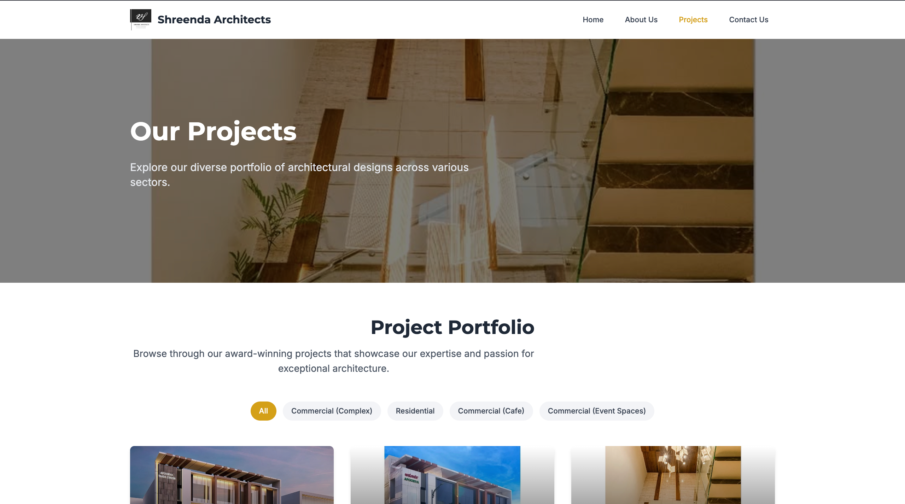

# Shreenda Architects

A modern, responsive portfolio website for an architecture firm that showcases their projects, services, team, and contact information. The site features a clean, minimalist design that puts the focus on architectural work while providing a seamless user experience.

[Live Demo](https://gauravshidling.github.io/shreenda-architects/)



## ✅ Project Requirements & Implementation

### 1. Tech Stack

- **React.js (Functional Components + Hooks)**
  - Built using modern React with functional components
  - Extensive use of hooks (useState, useEffect, useParams, etc.)
  - Custom hooks for reusable functionality

- **React Router (for multi-page navigation)**
  - HashRouter implementation for GitHub Pages compatibility
  - Multiple routes with dynamic project pages
  - 404 page handling for direct URL access

- **State Management: React Context API**
  - Used for managing global state and theme
  - Component-level state with useState for local state management

- **CSS Framework: Tailwind CSS**
  - Fully responsive design with Tailwind utility classes
  - Custom design system with consistent spacing, colors, and typography
  - Mobile-first approach with responsive breakpoints

- **Version Control: Git & GitHub**
  - Git for version control
  - GitHub for repository hosting
  - GitHub Pages for deployment

### 2. Core Features

- **Multiple Pages/Routes**
  - Home - Showcasing featured projects and services
  - Projects - Gallery of all architectural projects with filtering
  - About - Company history, team members, and philosophy
  - Contact - Form with validation and Google Maps integration
  - Project Detail - Dynamic pages for each project with detailed information

- **State Management Across Components**
  - Project data shared between components
  - Form state management in contact form
  - Navigation state for mobile menu

- **Component Patterns Implementation**
  - Props for component configuration
  - Conditional rendering for UI states
  - List rendering for projects, team members, and services
  - Form handling with validation

- **Form Validation**
  - Client-side validation for the contact form
  - Field-specific error messages
  - Real-time validation as user types
  - Integration with Formspree for form submission

- **API Integration**
  - Formspree API for contact form submission
  - Google Maps API for location display
  - Project data managed through structured JSON

- **Responsive Design**
  - Mobile-first approach
  - Flexible layouts that adapt to screen sizes
  - Optimized images for different screen resolutions
  - Touch-friendly navigation

### 3. Good Practices

- **Modular Folder Structure**
  ```
  /src
    /assets       # Images and static assets
    /components   # Reusable UI components
    /data         # JSON data files
    /pages        # Page components
    /hooks        # Custom React hooks
    /utils        # Utility functions
  ```

- **Clean, Well-Commented Code**
  - Consistent naming conventions
  - Component-based architecture
  - Separation of concerns
  - Helpful comments explaining complex logic

- **Environment Variables**
  - API keys stored in .env files (not committed to version control)
  - Configuration variables for deployment environments

- **Reusable Components**
  - Button, Card, Section components
  - Layout components for consistent structure
  - Form input components with validation

- **No Hard-Coded Values**
  - Configuration objects for repeated values
  - Constants file for static values
  - Dynamic routing based on data

## 🌟 Special Features

### Google Maps Integration
The Contact page includes an interactive Google Maps component that:
- Shows the firm's office location
- Provides directions to the office
- Allows users to explore the surrounding area
- Is fully responsive on all devices

### Custom Project Filtering
The Projects page includes a filtering system that allows users to:
- Filter projects by category (Residential, Commercial, etc.)
- Sort projects by date or name
- View projects in different layout options

### Seamless Form Experience
The contact form provides a smooth user experience with:
- Real-time validation
- Clear error messages
- Success/error states
- Integration with Formspree for actual email delivery

## 📱 Responsive Design

The site is fully responsive with specific optimizations for:
- Mobile phones (portrait and landscape)
- Tablets
- Desktop displays
- Large monitors

## 🚀 Getting Started

### Prerequisites
- Node.js (v14.0.0 or higher)
- npm or yarn

### Installation

1. Clone the repository
```bash
git clone https://github.com/GauravShidling/shreenda-architects.git
cd shreenda-architects
```

2. Install dependencies
```bash
npm install
# or
yarn install
```

3. Start the development server
```bash
npm run dev
# or
yarn dev
```

4. Build for production
```bash
npm run build
# or
yarn build
```

## 📝 Project Structure

```
shreenda-architects/
├── public/               # Public assets
│   ├── images/           # Static images
│   └── 404.html          # Custom 404 page for GitHub Pages
├── src/
│   ├── assets/           # Project assets (images, etc.)
│   ├── components/       # Reusable components
│   │   ├── Button.jsx
│   │   ├── ContactForm.jsx
│   │   ├── Footer.jsx
│   │   ├── Hero.jsx
│   │   ├── Navbar.jsx
│   │   ├── ProjectCard.jsx
│   │   └── ...
│   ├── data/             # Data files
│   │   └── projects.js   # Project data
│   ├── pages/            # Page components
│   │   ├── About.jsx
│   │   ├── Contact.jsx
│   │   ├── Home.jsx
│   │   ├── Projects.jsx
│   │   └── ProjectDetail.jsx
│   ├── App.jsx           # Main App component
│   ├── index.css         # Global styles
│   └── main.jsx          # Entry point
├── .gitignore            # Git ignore file
├── index.html            # HTML template
├── package.json          # Project dependencies
├── README.md             # Project documentation
└── vite.config.js        # Vite configuration
```

## 🔧 Technologies Used

- [React](https://reactjs.org/) - UI library
- [React Router](https://reactrouter.com/) - Routing
- [Tailwind CSS](https://tailwindcss.com/) - CSS framework
- [Vite](https://vitejs.dev/) - Build tool
- [Formspree](https://formspree.io/) - Form submission
- [Google Maps API](https://developers.google.com/maps) - Maps integration
- [GitHub Pages](https://pages.github.com/) - Hosting
